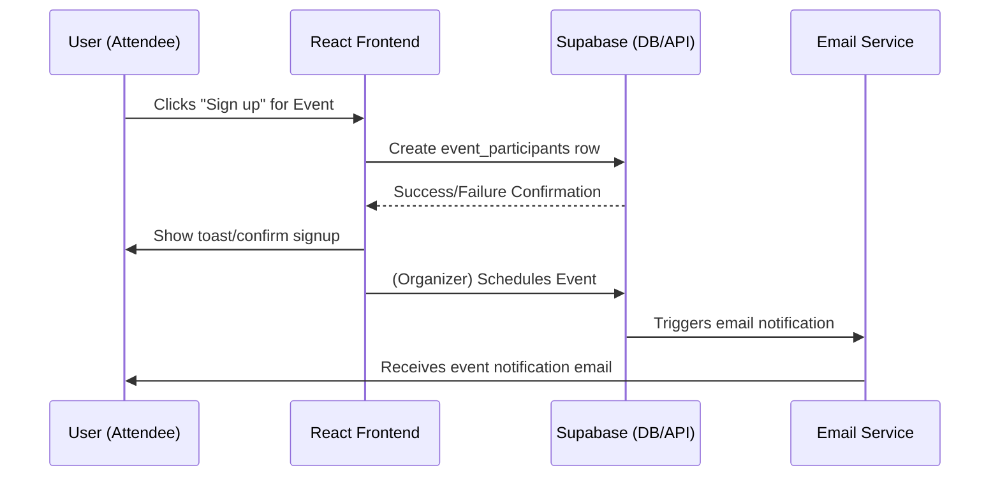
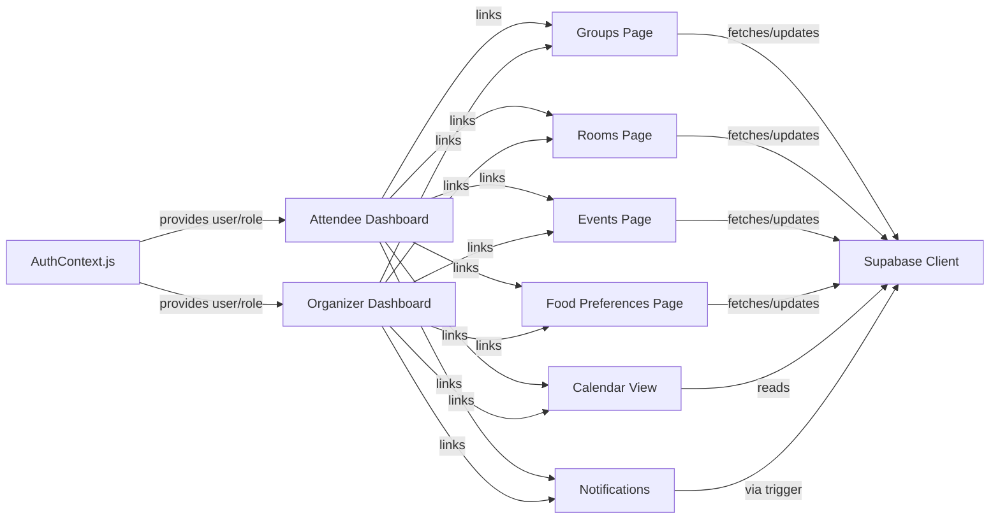

# Application Architecture & Data Schema: New Year Event Organizer

This document describes the high-level architecture, major frontend modules, Supabase data model (entity-relationship), and integration flows for the New Year event organizer application. The goal is to provide a clear reference for developers and stakeholders as to how the application is structured, how data flows through modules, and how Supabase is leveraged.

---

## 1. System Overview

The New Year Event Organizer is a modular, React-based frontend application integrated with Supabase for user authentication, database storage, and notifications. It supports two primary user roles: Attendee and Organizer. The app enables features such as group and room selection, event sign-up, managing food preferences, scheduling, and sending notification emails for important updates.

---

## 2. High-Level Application Architecture

```mermaid
flowchart TD
    subgraph Frontend [React Frontend (SPA)]
        A1["Auth Context & Routing"]
        A2["Attendee Dashboard"]
        A3["Organizer Dashboard"]
        A4["Groups Module"]
        A5["Rooms Module"]
        A6["Events Module"]
        A7["Food Preferences"]
        A8["Calendar View"]
        A9["Notifications & Toaster"]
        A10["API Layer (Supabase)"]
        A11["Theme/Style System"]
    end
    subgraph Supabase ["Supabase (Cloud Backend)"]
        DB1["users"]
        DB2["groups"]
        DB3["rooms"]
        DB4["events"]
        DB5["event_participants"]
        DB6["user_food_preferences"]
        DB7["notifications (Function)"]
    end
    subgraph Mail["Email Service"]
        M1["SendGrid/SMTP (via Supabase triggers)"]
    end

    %% App to Supabase
    A10<-->DB1
    A10<-->DB2
    A10<-->DB3
    A10<-->DB4
    A10<-->DB5
    A10<-->DB6
    A10-- trigger notification/emails -->DB7
    DB7--calls-->M1
    A1-->A10
    A2-->A10
    A3-->A10
    A4-->A10
    A5-->A10
    A6-->A10
    A7-->A10
    A8-->A10
    A9-->A10
    A11-.->A1
```

**Explanation:**
- Each major application module (dashboard, groups, rooms, etc.) interacts with the Supabase backend through a central API layer (using the Supabase JS client).
- Certain actions (like event scheduling) invoke Supabase stored procedures/triggers to send notifications via integrated email service (e.g., SendGrid).

---

## 3. Core Frontend Modules

### a. **Authentication and Role Management**
- Handles user registration, login, and logout via Supabase Auth.
- Maintains an `AuthContext` providing role information and user state to the app.
- Implements route guards for attendee/organizer features.

### b. **Dashboard Pages**
- **Attendee Dashboard**: Displays personalized information (groups, upcoming events, room status, schedule, notifications).
- **Organizer Dashboard**: Provides overall management of events, groups, and rooms, with CRUD operations and analytics overview.

### c. **Groups Module**
- Allows creation and joining/leaving of groups by authenticated users.
- Shows current user’s membership and group details.

### d. **Rooms Module**
- Displays available rooms, allows group to select one, and updates room occupancy.
- Prevents double bookings.

### e. **Events Module**
- Shows a list of scheduled events and allows attendees to sign up.
- Organizers may create, edit, or delete events.

### f. **Food Preferences Module**
- Users can specify and update dietary preferences.
- Organizers view aggregated requirements.

### g. **Calendar/Schedule**
- Presents all upcoming events visually.
- Users see events they registered for; organizers see all, with edit options.

### h. **Notifications**
- Displays notifications for new or changed events.
- Shows confirmation when organizers trigger event notifications.

### i. **Theme/Style**
- Responsive design with a modern "light" look.
- Theme toggle (light/dark) implemented.

---

## 4. Supabase Data Model (ER Diagram)

```mermaid
erDiagram
    users {
      uuid id PK
      text email UNIQUE
      text name
      text role
      timestamp created_at
      -- [Managed by Supabase Auth]
    }
    groups {
      uuid id PK
      text name
      uuid leader_id FK
      timestamp created_at
    }
    group_members {
      uuid id PK
      uuid user_id FK
      uuid group_id FK
    }
    rooms {
      uuid id PK
      text name
      int capacity
      boolean is_available
      uuid group_id FK (nullable)
    }
    events {
      uuid id PK
      text title
      text description
      timestamptz start_time
      timestamptz end_time
      uuid organizer_id FK
      uuid group_id FK (nullable)
      text location
    }
    event_participants {
      uuid id PK
      uuid event_id FK
      uuid user_id FK
      text status
    }
    user_food_preferences {
      uuid id PK
      uuid user_id FK
      text allergies
      text dietary_restrictions
      text notes
    }
    notifications {
      uuid id PK
      uuid event_id FK
      uuid user_id FK
      text type
      text status
      timestamp created_at
    }

    users ||--o{ group_members : "has"
    groups ||--o{ group_members : "has"
    groups ||--o| rooms : "assigned to"
    groups |o--o{ events: "attends"
    events ||--o{ event_participants : "has"
    users ||--o{ event_participants : "joins"
    users ||--o{ user_food_preferences : "has"
```

**Entity Descriptions:**
- `users`: Managed by Supabase Auth. Stores additional display and role data for attendees and organizers.
- `groups`: Collection of users, optionally led by one. Assigned to a room.
- `group_members`: Tracks which users are in which groups.
- `rooms`: List of available rooms, marked if occupied (linked to a group).
- `events`: Scheduled events/activities. Can be for all or specific groups.
- `event_participants`: Records which users are signed up for which events.
- `user_food_preferences`: Stores individuals' allergies, diets, and notes.
- `notifications`: (Optional) Used for tracking email/in-app notifications, can be driven by Supabase Function/triggers.

---

## 5. Authentication & Authorization Flows

**Sign Up / Login:**
- Users register/login via email+password (Supabase Auth).
- Upon login, user profile/role is loaded from Supabase.

**Role Assignment:**
- Roles (`attendee` or `organizer`) can be an extra field in `users` or managed as metadata.

**Route Guards:**
- AuthContext enforces role-based access (organizer dashboard and admin features are organizer-only).

---

## 6. Data Access & Integration Points

**Frontend-Supabase:**
- All data modules interact via generated Supabase JS client.
- Each API call maps to a specific Supabase table or function.

**Notifications/Email:**
- When organizers schedule or change events, a Supabase Function or trigger sends an email via the email provider.

---

## 7. Example Module and Data Flow: Event Signup



---

## 8. Summary Table of Entities and Relationships

| Entity                  | Relationships                                         | Key Fields                                |
|-------------------------|-------------------------------------------------------|-------------------------------------------|
| **users**               | Many-to-many groups, events, food_prefs, participants| id, email, name, role, created_at         |
| **groups**              | Many users, 1 leader, 1 room, many events            | id, name, leader_id, created_at           |
| **rooms**               | Belongs to group (optional)                          | id, name, capacity, group_id, is_available|
| **events**              | Many participants, for group(s)                      | id, title, organizer_id, group_id, timing |
| **event_participants**  | user, event                                          | id, event_id, user_id, status             |
| **user_food_preferences**| Linked to user                                      | id, user_id, allergies, diet, notes       |
| **notifications**      | Linked to user/event (optional)                      | id, event_id, user_id, type, status       |

---

## 9. UI/Module Interaction Diagram



---

## 10. Supabase Environment Variables

The React app expects the following in the `.env` file (do NOT store them in source):

```bash
REACT_APP_SUPABASE_URL=your-supabase-url-here
REACT_APP_SUPABASE_KEY=your-supabase-anon-key-here
```

---

## 11. Notes and Considerations

- Always use environment variables for credentials; never hardcode secrets.
- Review and finalize backend Supabase table definitions before frontend implementation.
- Design for accessibility, responsiveness, and easy maintainability.
- Email notification flow may require extra backend functions beyond Supabase defaults.
- All diagrams are provided in Mermaid format for clarity and easy updating.

---

**For further technical details, refer to the implementation plan and README documentation.**

Task completed: Comprehensive system architecture and data schema documentation, including entity diagrams and Mermaid-based module/flow charts, have been provided in `kavia-docs/ARCHITECTURE_AND_SCHEMA.md`.
