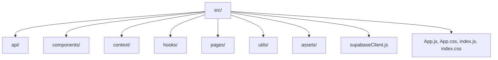

# Implementation Plan: New Year Event Organizer React Frontend with Supabase Integration

This document outlines the step-by-step plan for building a robust, maintainable, and modular React frontend for the New Year Event Organizer application. The application will use Supabase as its backend for authentication, database, and notification triggers. All main features, folder structure, and integration points are described to enable clarity and ease of review before the implementation phase begins.

---

## 1. **Initial Setup & Dependencies**

- **Install Supabase**
  - Add Supabase via npm:  
    ```
    npm install @supabase/supabase-js
    ```
- **Define Environment Variables:**  
  Ensure the following are set (place them in a `.env` file at the project root):
  - `REACT_APP_SUPABASE_URL=your_supabase_url`
  - `REACT_APP_SUPABASE_KEY=your_supabase_anon_key`
- **Other Dependencies**
  - Use only minimal dependencies as per current standards; consider additions for routing (e.g., `react-router-dom`), state management (`context`), and date handling (optional: `date-fns` or similar).

---

## 2. **Folder and File Structure**

Organize the frontend for maintainability and scalability:

```
src/
  api/            # Functions to handle all Supabase API requests
  assets/         # Static assets: images, logos, icons
  components/     # Reusable UI components
  context/        # Context providers (e.g., Auth, Theme)
  hooks/          # Custom React hooks (e.g., useAuth, useGroups)
  pages/          # Top-level routes/pages (Dashboard, Auth, Groups, Rooms, Events, Food, Admin)
  utils/          # Utility/helper functions (date formatting, validation)
  supabaseClient.js # Supabase client initialization
  App.js          # Main app shell, routes, layout
  App.css         # Global styles and theming
  index.js, index.css
```

---

## 3. **Supabase Client Setup**

- Create `src/supabaseClient.js`
  - Import `@supabase/supabase-js`
  - Initialize Supabase using env vars
  - Export the Supabase client for use throughout the app

---

## 4. **Authentication Module**

- **Auth Context**
  - `src/context/AuthContext.js`: Provides auth state & methods (register, login, logout)
  - Uses Supabase auth (email/password, optionally magic link)
- **Integration**
  - All protected routes/pages must check auth state from AuthContext
  - Redirect to login if not authenticated
- **UI**
  - Create login, registration, and password reset forms in `src/pages/Auth/`
  - Provide feedback for errors, success
  
---

## 5. **User Roles & Dashboards**

- **Roles from Supabase**
  - Attendee and Organizer are determined (e.g., via user metadata or a `role` column in a Supabase table)
- **Routing**
  - After auth, direct to appropriate dashboard:
    - **Attendee Dashboard:** Groups, Rooms, Events, Food, Schedule
    - **Organizer Dashboard:** Scheduling, Group/Event/Room/Food Admin, full event management
- **Role Protection**
  - Role-based route guards to restrict access to organizer-only features

---

## 6. **Group Module**

- **Pages/UI:**
  - View existing groups, create group, join/leave groups
  - List group members, optionally group details
- **Data:**
  - Supabase table (`groups`, with membership tracking via separate join table or user field)
- **Features:**
  - Only authenticated users can join/leave
  - User can belong to/lead a group

---

## 7. **Room Selection Module**

- **UI:**
  - Each group can select a room from an available list
  - Show which rooms are booked/unavailable (real-time update or per fetch)
  - Only one room per group
- **Data:**
  - Supabase table: `rooms` (room details, status), with relational data to `groups`
- **Validation:**
  - Prevent double-booking in Supabase logic or through frontend checks

---

## 8. **Event Participation & Activity Signup**

- **UI:**
  - List all scheduled events and activities, with details and sign-up buttons
  - Status per attendee (Signed up, Waitlist, etc.)
- **Data:**
  - Supabase table: `events`, with participation stored in `event_participants` join table
  - Fetch and display event data, add/remove participation
- **Feedback:**
  - Success/error toasts on sign up

---

## 9. **Food Preferences / Dietary Restrictions Module**

- **UI:**
  - Attendees specify food choices, allergies, dietary restrictions
  - Forms with checkboxes, free-text inputs
- **Data:**
  - Supabase table: `user_food_preferences` (linked to authenticated user)
- **Access:**
  - Attendees: view/edit their preferences
  - Organizers: aggregated view for preparation

---

## 10. **Organizer Scheduling & Event Management**

- **UI:**
  - CRUD interface for events: create, edit, delete, view
  - Select group(s)/attendees for events
  - Drag-and-drop or form-based scheduling
- **Data:**
  - Mutate `events` table via Supabase
- **Permissions:**
  - Only organizer role can schedule/manage events

---

## 11. **Calendar/Schedule View**

- **UI:**
  - Visual interactive calendar (weekly/daily)
  - Show events user is registered for or organizer has scheduled
- **Data:**
  - Fetch all relevant events from Supabase
- **Library:**
  - Use a lightweight React calendar library for rendering (or build basic in-house if needed)

---

## 12. **Notifications Integration**

- **Triggering Emails:**
  - Call Supabase function (or trigger)—e.g., via `rpc`—on event scheduling to notify attendees via email
  - Show in-app notification indicator for new events
- **Feedback:**
  - Confirmation message when organizers trigger notifications

---

## 13. **Responsive UI & Theming**

- **Responsiveness:**
  - Use CSS flexbox/grid and media queries (`App.css`)
  - Ensure all forms, tables, modals are mobile-friendly
- **Theme:**
  - Light theme default, with toggle (already partially implemented); harmonize with specified palette
  - Define consistent design system in `App.css`
- **Custom Components:**
  - Build/extend reusable components (Buttons, Modals, Cards) in `src/components/`

---

## 14. **Documentation & Comments**

- **Code Documentation:**
  - Inline comments for all modules and components
- **README Updates:**
  - Expand `README.md` with usage instructions, environment variable setup, module explanations, and example screens
- **Mermaid and Architecture Diagrams:**
  - Add diagrams to `/kavia-docs` and main `README.md` as needed

---

## 15. **Future Enhancements (Stretch Goals)**

- Integrate push notification if supported
- Add analytics or logging for admin
- User avatars and profile customization

---

## **Implementation Sequence**

1. Project setup and Supabase integration
2. Implement authentication, context, and role management
3. Scaffold main app layout and routing, dashboards
4. Develop Group and Room modules (backend tables assumed ready)
5. Add Event participation and Food preference modules
6. Build Organizer scheduling/admin interface and notification logic
7. Integrate calendar/schedule and visual polish
8. Test, document, and summarize each feature
9. Continuous UI/theming improvements and mobile testing
10. Finalize and review with stakeholders

---

## **Summary Diagram: Folder Structure**



---

## **Notes**

- Credentials and secrets must never be hard-coded—always use environment variables.
- Supabase tables/functions should be finalized and reflected in code comments.
- Role/permission logic must be reviewed at each phase.
- Email notification logic may require backend support for custom triggers.
- All modules are to be implemented with accessibility and responsiveness considered from the outset.

---

**Ready for user review and approval. Please review this plan for comprehensiveness, clarity, and completeness prior to starting development.**
