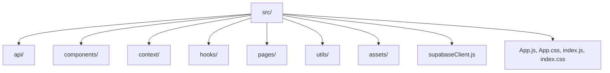

# Implementation Plan: New Year Event Organizer React Frontend with Supabase Integration

This implementation plan has been updated to fully align with the detailed requirements and UI/UX direction provided in the official design document. Any newly extracted screens, flows, layouts, and design system changes from the UX reference are integrated throughout. Use this as the canonical step-by-step guide for building the application with robust attention to the desired user experience.

---

## 1. **Initial Setup & Dependencies**

- **Install Supabase & Routing/UI Libraries**
  - `npm install @supabase/supabase-js`
  - Add `react-router-dom` for navigation and routing.
  - Consider light icon set (e.g., `react-icons`) for festive motifs.
- **Define Environment Variables**
  - `.env` file at root (do not commit):
    - `REACT_APP_SUPABASE_URL=your_supabase_url`
    - `REACT_APP_SUPABASE_KEY=your_supabase_anon_key`
- **Additional Recommendations**
  - Use context for theme and language switching.
  - Enable stepper/progress bar UI (for registration/event flows).
  - Add a simple toast/notification system (for slide-in confirmation and engagement).

---

## 2. **Folder and File Structure**

Organize for maintainability, modularity, and UI flow:
```
src/
  api/                    # Supabase API logic
  assets/                 # Images, logo, line icons, confetti svgs
  components/             # Reusable UI widgets (Card, FAB, Modal, Icon, Toast, Stepper, ProgressBar, ButtonChip)
  context/                # Providers: Auth, Theme, Notification
  hooks/                  # Reusable hooks (e.g., useAuth, useGroup, useSnack)
  pages/
    Landing/              # Hero, registration entry, login
    Registration/         # Multi-step, progress bar, validation
    Groups/               # List, card/fab, join/create
    Rooms/                # Grid, cards, selection logic
    Events/               # List/schedule, RSVP, add-to-calendar, color-coded
    Food/                 # Dietary preference, allergy, meal plan
    Organizer/            # Dashboard, event CRUD, overview (table, calendar), notification mgmt
    Notifications/        # Center, profile/settings (toggle cards)
    Settings/             # Profile, theme toggle, language picker
    Chat/                 # (Optional: festive chat bubbles)
  utils/                  # Validation, formatting, accessibility helpers
  supabaseClient.js
  App.js, App.css, index.js, index.css
```

---

## 3. **Theming, Brand, and Style Guide**

- **Color Theme**
  - Primary accent: Festive Red (#D7263D)
  - Background: Half White (#F6F6F6), Light Grey (#E6E6E6)
  - Success/Available: Green ticks. Booked: Grey lock. Alerts/errors: Red highlights.
- **Typography**
  - Bold headings, clear readable body (sans-serif; Inter, Roboto recommended).
- **Iconography**
  - Simple line icons, subtle festive details (confetti, star). Icons must have ARIA labels.
- **Layout**
  - Cards for groups/events/rooms with shadow, white surface.
  - Stepper interface for registration/event creation/editing.
  - All screens mobile-first, responsive grid and layout.
- **Feedback**
  - Immediate: Glow/animation on selection, slide-in toasts for confirmation, red for key actions and errors.
- **Accessibility**
  - All controls are touch size and keyboard-accessible. ARIA, strong contrast, focus/validation states.
- **General Mood**
  - Festive but professional — all red accents subtle, never overwhelming; white/grey dominates background.

---

## 4. **Screen-by-Screen Module Plan**

### A. Landing Page & Registration

- Hero header (confetti/star motif, logo left, CTA red "Get Started").
- Language picker, login/register top right.
- **Registration:** Multi-step (Personal > Group > Preferences), red-accent progress bar at top, outlined input fields (grey), field focus highlights in red, step validation and error states.
- **Login:** Boxed layout on split grey/white background, quick login (email/phone), "Forgot password" link in red.

### B. Group Module

- **Group List:** Card layout, avatars for existing members (max 4 +overflow), "Create New Group" as floating red FAB.
- **Group Modal:** Reusable modal overlays; overlay is subdued grey, content in white with red-highlighted confirmation, accessible ARIA labeling.
- **Join/Leave:** Visible red join/group button, group details, instant feedback.

### C. Stay/Room Selection

- **Room Page:** Responsive grid of cards; each card shows room type/capacity and status (green tick=available, grey lock=booked).
- **Selection:** Only one selectable per group, enforced visually (other cards disabled after selection), animated red glow on choose. All statefully validated per user/group.

### D. Event Participation

- Calendar (schedule) view — event blocks color-coded by category (red for most), interactive drag/add to schedule, confirmation checks in red.
- RSVP modal: attendee (individual/group) choice, event status update.
- Toast/visual feedback on RSVP and schedule actions.

### E. Food Preferences

- Button chips for dietary tags (outlined in red), structured editable meal plan per user in group.
- Allergy and dietary warnings shown in red alert box.
- All state changes confirmed visually.

### F. Organizer Scheduling & Dashboard

- **Event Dashboard:** Multi-step event creation/edit form (name, time, description, drag calendar integration).
- Red-accent confirmation for actions, event tables (alternating grey/white rows, event names in red).
- Full calendar (month/week/day views), today marked with red dot, drag-and-drop scheduling.
- Confirmation modals (red-themed), all overlays ARIA-accessible.

### G. Notifications & Profile/Settings

- **Notifications/Centre:** List events triggered, icons per type, slide-in toasts for new updates.
- **Settings:** Toggle for email notifications and types (descriptions in light grey text).
- Success toasts slide from top-right, always red-accented.
- **Profile:** Cards in grey/white, settings toggles in festive red.

### H. Extras/Optional

- **Theme Toggle:** Day theme (white, grey), night/festive mode (deeper reds).
- **Chat:** Festive-styled bubbles if implemented.
- **Push Notifications:** Red pill/badge overlay if enabled.

---

## 5. **Component Detail & Implementation Patterns**

- **Header:** Logo left, event name centered, user/profile right; always on a red top bar.
- **Card:** White, with drop shadow. Primary actions (Join/RSVP/Select) in bold red.
- **Modal & Overlay:** Grey backgrounds, white content, main action in red, cancel/subtle actions below.
- **Buttons:** Red for main confirm, default for others, always large tap targets.
- **Input/Field:** Outlined, clean, focused and errors highlighted red. Progress bars/steppers in red.
- **Table Rows:** Alternate gray/white. Event names always red.
- **Icons:** Minimalist, clear, festive cues.
- **Toast/Feedback:** Always for user action: add, RSVP, save, schedule, etc.

---

## 6. **User Flows & Navigation**

**Attendee:** Register ➔ Join/Create Group ➔ Select Room ➔ RSVP Events ➔ Set Food Preferences

**Organizer:** Dashboard ➔ Add/Edit Event (multi-step) ➔ Notify Attendees (auto notification triggered)

### Navigation:

- Landing > (if not auth) Login/Register (multi-step)
- Main navigation: Dashboard (attendee/organizer) → Groups / Rooms / Events / Food / Calendar / Notifications / Settings

---

## 7. **Feature Prioritization & Implementation Sequence**

1. **Core Scaffolding**
    - App structure, theme provider, router, layout shell, branding colors/styles
2. **Authentication & Role Context**
    - Multi-step register, login, forgot password
    - Auth context, role logic, guards
3. **Dashboard & Navigation Shell**
    - Side/top nav bar, role-based landing, responsive adjustment
4. **Groups Module**
    - Card list, create/join, FAB/button, modal workflows
5. **Room Selection**
    - Select-only grid cards, single-select logic, real-time status, animation
6. **Event Module**
    - Calendar/list view, RSVP/event add-toggle, event modal
7. **Food Preferences**
    - Editable chip UI, allergy indicators, aggregation for organizers
8. **Organizer Scheduling**
    - Organizer dashboard, event CRUD (table, calendar, modals)
    - In-app notification/confirmation
9. **Notifications & Engagement**
    - Toast system, notification center/profile toggles, email/push triggers
10. **Profile & Settings, Theme Toggle**
    - Light/festive mode, profile update, toggles for notification prefs
11. **Accessibility and Polish**
    - Keyboard, ARIA, contrast passes
12. **Testing, Documentation, & Review**
    - Feature by feature QA, usage docs, final review

---

## 8. **Future/Optional Enhancements**

- Festive chat (chat bubbles)
- Mobile push notifications (red badge)
- Avatar uploads, profile customization

---

## 9. **Diagrams & Visual References**

### Folder Structure


---

## 10. **General Notes & Accessibility**

- All modules/components must be mobile-friendly and pass accessibility checks.
- Credentials/keys must always use environment variables.
- All interaction patterns (registration stepper, FAB, chip, modal, alert, toast) must visually follow the design system.
- Email notifications should be styled to match in-app alerts (red accent, clean white/grey body, clear CTA buttons).
- ARIA/labeling, keyboard nav, and high contrast are mandatory.

---

**This revised plan is now tightly aligned with the supplied UI/UX design brief and requirements. Each feature or screen references concrete layout/interaction needs, themed design, screen flow, and accessibility requirements. Use this as the authoritative plan for implementation.**
